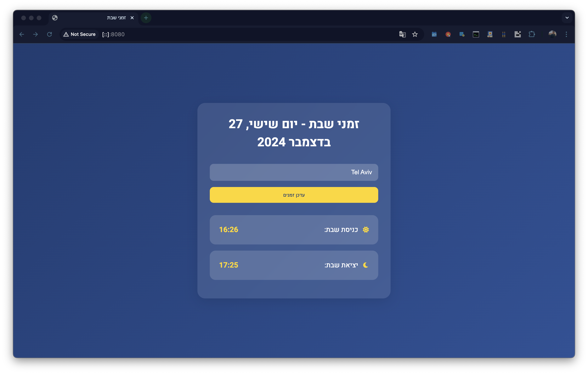

# 🕯️ Shabbat Times App

[](https://dorpascal.com/shabbat-times/)
[](https://github.com/Dor-sketch/shabbat-times/blob/main/LICENSE)
[](https://github.com/Dor-sketch/shabbat-times/stargazers)
[](https://chromewebstore.google.com/detail/תנ״ך-מקוון/jkadmhnjhehekcgcajgnjjiehiefndcd)
[](https://chromewebstore.google.com/detail/תנ״ך-מקוון/jkadmhnjhehekcgcajgnjjiehiefndcd)
[](https://chromewebstore.google.com/detail/תנ״ך-מקוון/jkadmhnjhehekcgcajgnjjiehiefndcd)

A modern, responsive web application for checking Shabbat times in Israeli cities. Available as both a web app and a Chrome extension.



## ✨ Features

- 🌍 Real-time Shabbat times for Israeli cities
- 🔍 Smart city autocomplete with Hebrew and English support
- 📍 Automatic location detection
- 🎨 Beautiful, responsive design with dark mode
- ⚡ Fast and lightweight
- 🌐 Fully localized in Hebrew
- 🔄 Automatic weekly updates

## 🚀 Demo

Try it live at [https://dorpascal.com/shabbat-times/](https://dorpascal.com/shabbat-times/)

## 🛠️ Installation

### Web Version

```bash
git clone https://github.com/Dor-sketch/shabbat-times.git
cd shabbat-times
# Open index.html in your browser
```

### Chrome Extension

1. Visit the [Chrome Web Store](https://chromewebstore.google.com/detail/תנ״ך-מקוון/jkadmhnjhehekcgcajgnjjiehiefndcd)
2. Click "Add to Chrome"
3. Enjoy easy access to Shabbat times!

## 💻 Technologies Used

- HTML5
- CSS3 with Flexbox & Grid
- Vanilla JavaScript
- [Hebcal API](https://www.hebcal.com/home/195/jewish-calendar-rest-api)
- [Font Awesome](https://fontawesome.com/) for icons
- [Google Fonts](https://fonts.google.com/) (Heebo)

## 🌟 Key Features Explained

### City Autocomplete

```javascript
const commonCities = [
    { name: 'Tel Aviv', id: 293397, hebrew: 'תל אביב' },
    { name: 'Jerusalem', id: 281184, hebrew: 'ירושלים' },
    // ... more cities
];
```

### Geolocation Support

```javascript
if ("geolocation" in navigator) {
    navigator.geolocation.getCurrentPosition(
        (position) => {
            const { latitude, longitude } = position.coords;
            fetchCityName(latitude, longitude);
        }
    );
}
```

### Time Calculations

```javascript
function getNextFriday(date) {
    const dayOfWeek = date.getDay();
    const daysUntilFriday = (5 - dayOfWeek + 7) % 7;
    const nextFriday = new Date(date);
    nextFriday.setDate(date.getDate() + daysUntilFriday);
    return nextFriday;
}
```

## 📱 Responsive Design

The app is fully responsive and works seamlessly on:

- 📱 Mobile phones
- 💻 Tablets
- 🖥️ Desktop computers

## 🤝 Contributing

Contributions are welcome! Please feel free to submit a Pull Request. For major changes, please open an issue first to discuss what you would like to change.

1. Fork the repository
2. Create your feature branch (`git checkout -b feature/AmazingFeature`)
3. Commit your changes (`git commit -m 'Add some AmazingFeature'`)
4. Push to the branch (`git push origin feature/AmazingFeature`)
5. Open a Pull Request

## 📄 License

This project is licensed under the MIT License - see the [LICENSE](LICENSE) file for details.

## 🙏 Acknowledgments

- [Hebcal](https://www.hebcal.com/) for their excellent API
- All contributors and users of the app
- Special thanks to the Israeli tech community

## 📞 Contact

Dor Pascal - [@DorPascal](https://github.com/Dor-sketch)

Project Link: [https://github.com/Dor-sketch/shabbat-times](https://github.com/Dor-sketch/shabbat-times)

---

<div align="center">
Made with ❤️ in Israel
</div>